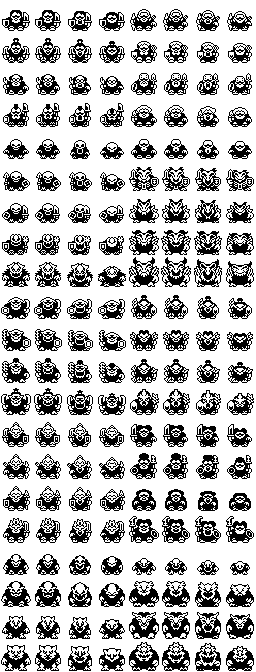
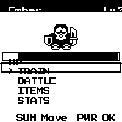
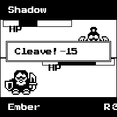
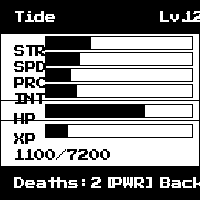
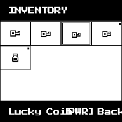
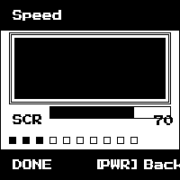
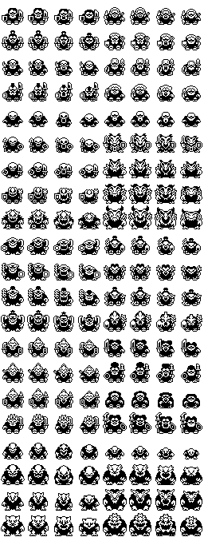
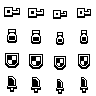

# EmberTide

**A pocket-sized auto-battler that lives on a 1-bit e-paper display.**

EmberTide is a standalone virtual pet and RPG built entirely in C for the ESP32-S3. Two devices discover each other over Bluetooth, exchange a shared random seed, and fight it out — round by round, bit by bit — on a 200x200 pixel black-and-white screen. No companion app. No cloud. Just two tiny screens and a deterministic combat engine that both devices can verify is fair.

<p align="center">
  
</p>

---

## What Is This?

EmberTide is a game that runs on the [Waveshare ESP32-S3-ePaper-1.54](https://www.waveshare.com/wiki/ESP32-S3-ePaper-1.54) — a tiny board with a 200x200 e-paper display, two buttons, Bluetooth, WiFi, a speaker, and 8MB of flash. The entire game fits in that flash alongside an OTA update partition.

You raise a creature. You train it. You fight other players' creatures over BLE. When your creature dies, it's reborn weaker — but you unlock permanent legacy perks that compound across lifetimes.

### The Gameplay Loop

1. **Train** — Play mini-games (speed, power, intelligence) to earn XP and level up
2. **Equip** — Collect passive "Joker" items that trigger during combat (heal on kill, crit damage boost, stat swaps)
3. **Battle** — Walk up to another player, press a button, and watch your creatures auto-battle over Bluetooth
4. **Die** — When you lose enough HP, your creature dies. Stats are halved. But you earn Legacy Points.
5. **Rebirth** — Spend Legacy Points on a permanent skill tree. Come back stronger. Do it again.

### Five Classes

| Class | Identity | Stat Bias |
|-------|----------|-----------|
| **Bruiser** | Raw damage dealer | +STR, +SPD |
| **Trickster** | Evasion specialist | +SPD, +PRC |
| **Hex** | Tactical reroller | +PRC, +INT |
| **Warden** | Balanced tank | +STR, +SPD, +INT |
| **Wildcard** | Chaos agent (random passive) | +STR, +SPD, +PRC |

Stats follow a logarithmic curve — early training gains are dramatic, but max-level characters converge. Class identity comes from the perks and items you choose, not raw stat advantage.

---

## Screen Layouts

All screens render to a 200x200 1-bit framebuffer and are verified by an automated visual regression pipeline. These are the current host-rendered layouts (geometry only — sprite and font integration happens at hardware bring-up):

<p align="center">
  
  
  
  
</p>
<p align="center">
  <em>Home &mdash; Combat &mdash; Stats &mdash; Inventory</em>
</p>
<p align="center">
  
  
</p>
<p align="center">
  <em>Training &mdash; Dialogue (Rebirth confirmation)</em>
</p>

---

## Combat System

Combat is fully deterministic. Both devices share a PRNG seed over Bluetooth and step through rounds independently — verifying each other's state with CRC32 hashes after every round. If the hashes diverge, the match is halted. No cheating possible.

Each round:
- **Attack** — Roll a d6, adjust through a precision-tier lookup table, add strength bonus
- **Dodge** — Defender rolls d100 against a speed-derived dodge chance (capped at 40%)
- **Crit** — High raw rolls trigger critical hits based on precision tier (damage x1.5)
- **Reroll** — Intelligence grants tactical reroll charges (spend to redo bad attacks or force opponents to redo good ones)
- **Items** — Equipped Jokers trigger at specific lifecycle points (on attack, on defend, on kill, on round end...)
- **Overtime** — After round 8, both fighters take escalating unavoidable damage. Round 12 is the hard limit.

### Items (Jokers)

Items are passive combat modifiers evaluated in strict slot order. Some examples from the current implementation:

| Item | Rarity | Effect |
|------|--------|--------|
| Iron Fist | Common | +1 damage on every attack |
| Tough Hide | Common | -1 damage taken (minimum 1) |
| Lucky Coin | Common | 10% chance of +2 bonus damage each round |
| Vampire Fang | Uncommon | Heal 5 HP on kill |
| Haymaker | Uncommon | Crits deal x2 damage instead of x1.5 |
| Bandage | Uncommon | Heal 1 HP per round if below 50% |
| Chaos Orb | Rare | Swap a random stat with your opponent for one round |
| Time Loop | Legendary | At the end of round 6, restore both fighters' HP to round 3 values |

---

## Technical Architecture

```
APPLICATION          main/app_main.c, event_bus, FSM, vm_builder
                     |              |              |
GAME ENGINE          combat, items, training, progression, legacy, PRNG, CRC32
                     |
PRESENTATION         framebuffer, sprites, text, 6 screen renderers, dialogue widget
                     |
CONNECTIVITY         BLE packets, round-sync hashing, protocol DTOs
                     |
PLATFORM             storage, input, power, clock (interfaces)
                     |
HAL                  e-paper SPI, LittleFS flash, GPIO buttons, piezo audio, BLE, WiFi, sleep
```

Key constraints:
- **Zero floats** — All math is integer-only. The stat curve is a precomputed 256-entry lookup table.
- **Deterministic PRNG** — Frozen XOR-shift32 with hardcoded shift constants. Sequence-tested against known values.
- **No global mutable state** — All game state flows through explicit struct pointers.
- **Layer isolation** — `game/` cannot see `hal/`. `presentation/` cannot see `game/`. Enforced by CMake include paths and compile-time boundary tests.

### Test Coverage

| Layer | Host Tests | Visual Baselines |
|-------|-----------|-----------------|
| Game engine (PRNG, CRC32, combat, items, training, legacy) | 30 | — |
| Presentation (framebuffer, sprites, text, screens) | 12 | 8 golden PNGs |
| Connectivity (protocol, sync) | 3 | — |
| Application (event bus, FSM) | 4 | — |
| HAL (mocked: e-paper, flash, GPIO, audio, sleep, BLE, WiFi) | 14 | — |
| **Total** | **63** | **8** |

Every test runs on the host (macOS/Linux) without hardware. The visual regression pipeline generates PNGs from the framebuffer and diffs them against committed golden baselines.

---

## Building

### Host Tests (no hardware required)

```bash
# Game logic + presentation tests
cd test/host && cmake -B build && cmake --build build && ctest --output-on-failure

# Visual regression (generates PNGs, compares to golden baselines)
cd test/visual && cmake -B build && cmake --build build
./build/render_all_screens && python3 diff_screens.py
```

### ESP32 Target (requires ESP-IDF v5.x + Xtensa toolchain)

```bash
. ~/esp/esp-idf/export.sh
idf.py set-target esp32s3
idf.py build
idf.py -p /dev/ttyUSB0 flash monitor
```

### Production Build

```bash
# Apply production overlay (ERROR-only logging, -Os, silent assertions)
cp sdkconfig.production sdkconfig
idf.py build
```

---

## Project Structure

```
components/
  game/           Pure logic: PRNG, CRC32, combat, items, training, progression, legacy
  presentation/   Framebuffer, sprites, text, screen renderers (host-compilable)
  hal/            Hardware abstraction: e-paper, flash, GPIO, audio, BLE, WiFi, sleep
  connectivity/   BLE protocol packets, round-sync verification
  platform/       Storage, input, power interfaces (stubs)
main/             App entry point, event bus, FSM, view model builder
test/host/        63 CTest host tests (game + presentation + HAL mocks)
test/visual/      PNG generation + golden baseline regression
test/target/      ESP32 on-device integration tests (scaffolding)
assets/           1-bit pixel art: characters, items, tiles, icons, fonts
docs/             Architecture doc, design doc, hardware QA checklist
```

---

## Assets

All pixel art is 1-bit black-and-white, designed for the e-paper display.

<p align="center">
  
  
  
</p>

168 character frames (21 creatures x 8 animation frames), item sprites, dungeon/land/crypt/hold tile sets, and icon sheets for RPG symbols, weather, and UI elements. Font glyphs are variable-width with precomputed metrics.

See [docs/sprite-map.md](docs/sprite-map.md) for the complete sprite atlas with pixel coordinates.

---

## Credits

Pixel art: [butterhands](https://butterhands.itch.io/) (characters, tiles), [nikoichu](https://nikoichu.itch.io/) (icons), [i-am-44](https://i-am-44.itch.io/) (items). Fonts: Press Start 2P, Jacquard 12.

See [docs/CREDITS.md](docs/CREDITS.md) for full attribution.

---

## Status

The entire game engine, presentation layer, connectivity protocol, and HAL interfaces are implemented and tested on the host. **63 tests pass. 8 visual golden baselines match.** The remaining work is hardware bring-up: flashing to physical ESP32-S3 boards, wiring the real SPI/BLE/WiFi drivers, and running the [hardware QA checklist](docs/HARDWARE_QA_CHECKLIST.md).

## License

This project is not yet licensed for distribution. All rights reserved.
